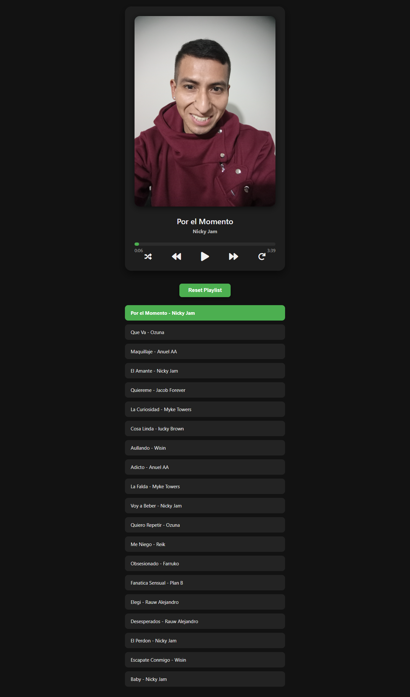

<<<<<<< HEAD
# 🎵 Reproductor de Música Aleatoria

Este proyecto es un reproductor de música interactivo creado con HTML, CSS y JavaScript. Permite a los usuarios escuchar una lista de canciones con controles modernos, animaciones suaves y diseño responsive.



---

## 🚀 Funcionalidades

✅ Reproducir, pausar, avanzar y retroceder canciones  
✅ Barra de progreso interactiva con tiempo actual y duración total  
✅ Modo aleatorio (shuffle)  
✅ Repetición de canción (loop)  
✅ Lista de reproducción visible y seleccionable  
✅ Guarda el estado (canción actual y progreso) con `localStorage`  
✅ Estilo moderno, accesible y adaptado a dispositivos móviles

---

## 🧰 Tecnologías utilizadas

- **HTML5** – Estructura semántica
- **CSS3** – Estilos, animaciones y diseño responsive
- **JavaScript** – Lógica de reproducción, eventos, manipulación del DOM
- **Font Awesome** – Iconos para los controles
- Música: **Mixkit**, libre de derechos de autor
---

## 🎧 Créditos musicales

La música utilizada en este proyecto ha sido descargada desde [Mixkit](https://mixkit.co/) y está **libre de derechos de autor**.

Autores destacados:

- Diego Nava
- Michael Ramir
- Eugenio Mininni
- Alejandro Magaña
- Mauro Urbina
- Arulo

---


## 📂 Cómo clonar y ejecutar

1. Clona este repositorio:
   ```bash
   git clone https://github.com/Frannkk-1994/random-music-app.git
=======
# random-music-app
"Aplicación de música con HTML, CSS y JavaScript para reproducir música de manera aleatoria"
>>>>>>> 386901bbabed05d748a33e1e3b0d9a38ad3d75f0
